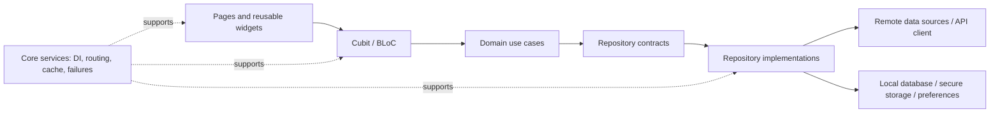

# Flutter Production App Showcase

[English](README.md) · [Türkçe](README.tr.md)

This repository presents selected engineering and UX aspects of a production Flutter application while the proprietary source code remains private.

> A concise, evidence-based engineering case study — not an open-source copy of the application and not a source-code dump.

## Overview

The underlying product is a production mobile application with content discovery, detail, reading, library/download, notification, and account-oriented flows. This showcase focuses on how those flows are engineered: clear architectural boundaries, predictable state, backend integration, responsive interfaces, caching, and failure recovery.

All statements in this repository were derived from read-only inspection of the private project. No performance numbers or technologies have been invented.

## Demo

Four purpose-recorded feature videos were reviewed and mapped into recruiter-friendly segments. Their raw files are intentionally not published because they contain third-party content and, in some scenes, visible community data.

| Area | Planned length | What it demonstrates |
| --- | ---: | --- |
| Home / Overview | 45 sec | Home composition, announcements, and navigation |
| Recommendations / History | 43 sec | Recommendation workflow and reading-history management |
| Search / Series Detail | 55 sec | Search, filtering, detail hierarchy, and primary actions |
| Reader Experience | 60 sec | Long-form reading controls, loading, and reader settings |
| Library / Chapter Selection | 45 sec | Selection, download actions, and progress states |

See the [demo preparation guide](demos/README.md). Public media will be added only after a sanitized recording uses publishable content and contains no personal data.

## Feature Demonstrations

- Discovery surfaces composed from reusable content sections and cards
- Detail and chapter flows with clear primary and secondary actions
- Reader controls designed around uninterrupted long-form content
- Library and background download progress states
- Search, notification, community, and account-oriented navigation flows
- Shared loading, empty, error, and retry experiences

The screenshots and recordings themselves are withheld until copyright-safe sample content is available.

## Architecture

The private application follows a feature-first, layered structure comparable to Clean Architecture:

Features own their presentation, domain, and data concerns. Shared infrastructure remains in a core layer. Domain contracts isolate business-facing code from API and persistence details. See [Architecture](docs/ARCHITECTURE.md).

## State Management

The application uses Cubit/BLoC with explicit state models. Shared selectors limit rebuilds to relevant state slices, while reusable paged-state owners distinguish initial loading, incremental loading, refresh, empty data, failure, and end-of-list states.

Cancelable operations are used for latest-wins interactions where stale asynchronous results should not update the UI.

## Networking & Data

- A shared Dio-based client centralizes HTTP behavior.
- Remote data sources convert transport responses into data models.
- Repository implementations bridge data sources and domain contracts.
- Operations return typed success/failure results rather than leaking transport exceptions into UI code.
- Drift provides structured local persistence; secure storage and preferences serve narrower storage needs.
- WebSocket/Socket.IO clients support real-time integration where required.

No endpoint, payload, credential, schema, or proprietary rule is disclosed here.

## Performance

The inspected project includes cursor-based incremental loading, granular BLoC selectors, cancelable asynchronous work, memory/disk image caching, centralized image fallbacks, background download handling, and responsive sizing primitives.

These are architectural observations, not benchmark claims. See [Performance](docs/PERFORMANCE.md).

## Error Handling & Reliability

Failures cross architectural boundaries as typed application failures. Shared UI components represent loading, empty, error, and retry states consistently. Network and image layers include timeout/fallback behavior, while long-running operations expose distinct progress states instead of blocking the primary UI.

## UI/UX Engineering

The UI is assembled from reusable widgets and shared design primitives. Responsive sizing and breakpoint-aware layouts adapt density and navigation presentation. Skeletons, placeholders, progressive loading, explicit retry actions, and stable content regions reduce ambiguity during asynchronous work.

## Technology Stack

| Area | Technologies observed in the private project |
| --- | --- |
| Application | Flutter, Dart |
| State | BLoC, Cubit, `flutter_bloc`, `bloc_concurrency`, Equatable |
| Functional results | `fpdart` |
| Networking | Dio, WebSocket, Socket.IO |
| Dependency injection | GetIt |
| Navigation | GoRouter |
| Persistence | Drift, secure storage, shared preferences |
| Media and cache | Cached Network Image, Extended Image, Flutter Cache Manager |
| Background/product services | Background Downloader, OneSignal |
| Quality | `bloc_test`, Mocktail, Very Good Analysis |

The sanitized [dependency manifest](pubspec-showcase.yaml) is illustrative and is not the production `pubspec.yaml`.

## Engineering Decisions

The strongest recurring decisions are boundary-oriented: keep transport details behind repositories, model UI states explicitly, initialize dependencies in a controlled order, centralize media behavior, and load large collections incrementally.

Read the evidence-based [Technical Decisions](docs/TECHNICAL_DECISIONS.md) for the problem → decision → trade-off format.

## About This Repository

This public repository is a portfolio artifact based on read-only architectural analysis of a private production application. It contains documentation and safe tooling only. It does **not** contain production source code, proprietary algorithms, backend endpoints, credentials, private configuration, customer data, database details, or copyrighted product media.

Türkçe sürüm için [README.tr.md](README.tr.md) dosyasına bakın.
