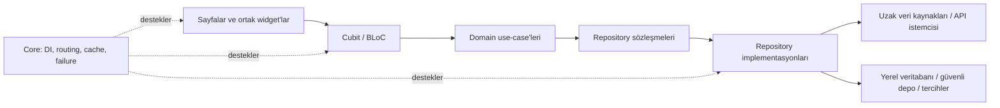

# Flutter Production App Showcase

[English](README.md) · [Türkçe](README.tr.md)

Bu depo, üretimde kullanılan bir Flutter uygulamasının seçilmiş mühendislik ve kullanıcı deneyimi yönlerini sunar; uygulamanın tescilli kaynak kodu gizli kalır.

> Bu çalışma uygulamanın açık kaynak kopyası veya kod dökümü değil, kısa ve kanıta dayalı bir mühendislik vaka analizidir.

## Genel Bakış

Temel ürün; içerik keşfi, detay, okuma, kütüphane/indirme, bildirim ve hesap odaklı akışlara sahip bir üretim mobil uygulamasıdır. Bu depo, söz konusu akışların nasıl tasarlandığına odaklanır: belirgin mimari sınırlar, öngörülebilir state yönetimi, backend entegrasyonu, responsive arayüzler, önbellekleme ve hata toparlama.

Buradaki tüm ifadeler özel projenin salt-okunur incelenmesine dayanır. Performans sayıları veya kullanılmayan teknolojiler eklenmemiştir.

## Demo

Onaylanmış portföy exportlarının birebir kopyası olan dört tam MP4 gösterimi eklendi. Harici video platformu gerektirmeden doğrudan GitHub üzerinden açılabilirler.

| Alan | Süre | İzle |
| --- | ---: | --- |
| Ana Sayfa / Genel Bakış | 45 sn | [▶ MP4 Videoyu İzle](https://github.com/Seyien/flutter-production-engineering-showcase/raw/main/demos/media/home-overview.mp4) |
| Öneriler / Okuma Geçmişi | 43 sn | [▶ MP4 Videoyu İzle](https://github.com/Seyien/flutter-production-engineering-showcase/raw/main/demos/media/recommendations-history.mp4) |
| Arama / Seri Detayı | 1 dk 55 sn | [▶ MP4 Videoyu İzle](https://github.com/Seyien/flutter-production-engineering-showcase/raw/main/demos/media/search-series-detail.mp4) |
| Okuyucu Deneyimi | 3 dk 16 sn | [▶ MP4 Videoyu İzle](https://github.com/Seyien/flutter-production-engineering-showcase/raw/main/demos/media/reader-experience.mp4) |

Ayrıntılar için [demo notlarına](demos/README.tr.md) bakın. Her bağlantı MP4 dosyasını doğrudan açar; harici video platformu gerekmez.

## Özellik Gösterimleri

- Yeniden kullanılabilir içerik bölümleri ve kartlarla kurulan keşif yüzeyleri
- Açık ana/ikincil eylemlere sahip detay ve bölüm akışları
- Kesintisiz uzun içerik tüketimine odaklanan okuyucu kontrolleri
- Kütüphane ve arka plan indirme ilerleme durumları
- Arama, bildirim, topluluk ve hesap odaklı navigasyon akışları
- Ortak yükleme, boş, hata ve yeniden deneme deneyimleri

Videolar ürün etkileşimini ve UI davranışını gösterir. Uygulama kaynak kodu, backend implementasyonu, credential veya özel konfigürasyon açığa çıkarılmaz.

## Mimari

Özel uygulama, Clean Architecture ile benzer özellik-öncelikli katmanlı bir yapı kullanır:

Her özellik presentation, domain ve data sorumluluklarını sahiplenir. Ortak altyapı core katmanında tutulur. Domain sözleşmeleri, uygulama davranışını API ve kalıcılık ayrıntılarından ayırır. Ayrıntılar: [Mimari](docs/ARCHITECTURE.tr.md).

## State Yönetimi

Uygulama, açık state modelleriyle Cubit/BLoC kullanır. Ortak selector yapıları rebuild işlemlerini yalnızca ilgili state parçalarıyla sınırlar. Yeniden kullanılabilir sayfalı state sahipleri; ilk yükleme, sonraki sayfa, yenileme, boş veri, hata ve liste sonu durumlarını birbirinden ayırır.

Eski asenkron sonuçların arayüzü güncellememesi gereken latest-wins etkileşimlerinde iptal edilebilir işlemler kullanılır.

## Ağ ve Veri

- Ortak Dio istemcisi HTTP davranışını merkezileştirir.
- Uzak veri kaynakları transport yanıtlarını data modellerine dönüştürür.
- Repository implementasyonları data source ile domain sözleşmelerini bağlar.
- İşlemler, transport exception'larını UI katmanına sızdırmak yerine tipli başarı/hata sonuçları döndürür.
- Drift yapısal yerel kalıcılık; secure storage ve preferences ise daha dar depolama ihtiyaçları için kullanılır.
- Gereken yerlerde WebSocket/Socket.IO istemcileri gerçek zamanlı entegrasyonu destekler.

Bu depoda endpoint, payload, kimlik bilgisi, şema veya tescilli kural açıklanmaz.

## Performans

İncelenen projede cursor tabanlı artımlı yükleme, parçalı BLoC selector'ları, iptal edilebilir asenkron iş, bellek/disk görsel önbelleği, merkezi görsel fallback'leri, arka plan indirme yönetimi ve responsive boyutlandırma araçları bulunur.

Bunlar mimari gözlemlerdir; benchmark iddiası değildir. Ayrıntılar: [Performans](docs/PERFORMANCE.tr.md).

## Hata Yönetimi ve Güvenilirlik

Hatalar mimari sınırlar arasında tipli uygulama failure'ları olarak taşınır. Ortak UI bileşenleri yükleme, boş, hata ve yeniden deneme durumlarını tutarlı gösterir. Ağ ve görsel katmanlarında timeout/fallback davranışı bulunur; uzun süren işlemler ana arayüzü kilitlemek yerine ayrı ilerleme durumları sunar.

## UI/UX Mühendisliği

Arayüz, yeniden kullanılabilir widget'lar ve ortak tasarım araçlarıyla kurulur. Responsive boyutlandırma ve breakpoint tabanlı düzenler, yoğunluğu ve navigasyon sunumunu ekrana göre uyarlar. Skeleton, placeholder, aşamalı yükleme, belirgin retry eylemleri ve kararlı içerik bölgeleri asenkron süreçlerde belirsizliği azaltır.

## Teknoloji Yığını

| Alan | Özel projede gözlemlenen teknolojiler |
| --- | --- |
| Uygulama | Flutter, Dart |
| State | BLoC, Cubit, `flutter_bloc`, `bloc_concurrency`, Equatable |
| Fonksiyonel sonuçlar | `fpdart` |
| Ağ | Dio, WebSocket, Socket.IO |
| Dependency injection | GetIt |
| Navigasyon | GoRouter |
| Kalıcılık | Drift, secure storage, shared preferences |
| Medya ve cache | Cached Network Image, Extended Image, Flutter Cache Manager |
| Arka plan/ürün servisleri | Background Downloader, OneSignal |
| Kalite | `bloc_test`, Mocktail, Very Good Analysis |

Temizlenmiş [bağımlılık manifesti](pubspec-showcase.yaml), üretim `pubspec.yaml` dosyası değil açıklayıcı bir örnektir.

## Mühendislik Kararları

Öne çıkan kararların ortak noktası sınırların korunmasıdır: transport ayrıntılarını repository arkasında tutmak, UI state'lerini açık modellemek, bağımlılıkları kontrollü sırada başlatmak, medya davranışını merkezileştirmek ve büyük listeleri artımlı yüklemek.

Problem → karar → ödün formatındaki kanıta dayalı açıklamalar için [Teknik Kararlar](docs/TECHNICAL_DECISIONS.tr.md) belgesine bakın.

## Bu Depo Hakkında

Bu public depo, özel bir üretim uygulamasının salt-okunur mimari analizine dayanan portföy çalışmasıdır. Dokümantasyon, onaylanmış demo çıktıları ve güvenli araçlar içerir. Üretim kaynak kodu, tescilli algoritma, backend endpoint'i, credential, özel konfigürasyon veya veritabanı ayrıntısı içermez. Public topluluk içeriği, açık sahip onayıyla kaydedilmiş arayüzün parçası olarak görünebilir. Demo içeriği yalnızca uygulama mühendisliği ve etkileşim tasarımını belgelemek amacıyla sunulur; üçüncü taraf içerik hakları ilgili sahiplerine aittir.
