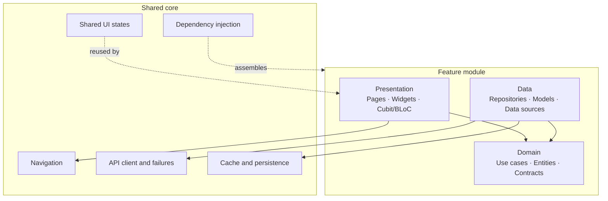

# Architecture

[English](ARCHITECTURE.md) · [Türkçe](ARCHITECTURE.tr.md)

This document summarizes patterns verified through read-only inspection of the private Flutter project. It intentionally omits source code, domain rules, endpoint details, database schemas, and internal naming.

## Structural model

The project is organized by product feature. Each substantial feature separates three responsibilities:

- **Presentation:** pages, reusable widgets, Cubit/BLoC owners, and UI state models
- **Domain:** entities, repository contracts, and use cases
- **Data:** transport/persistence models, remote and local data sources, and repository implementations

Shared services live in a core area rather than being reimplemented by individual features.

Dependency direction favors the domain: presentation invokes use cases and data implementations satisfy domain-owned repository contracts.

## State ownership

Cubit/BLoC instances own asynchronous workflows and expose explicit immutable states. Reusable selectors watch a focused state projection, reducing unnecessary rebuild scope. A shared paging owner models first load and next-page load independently and tracks cursor and end-of-data state.

Operations that can be superseded use cancelable latest-wins behavior so an older response does not overwrite a newer intent.

## Networking and repositories

A shared Dio client provides the transport foundation. Feature data sources make remote calls and translate responses into data-layer models. Repository implementations map those results across the domain boundary.

Remote exceptions are normalized into typed application failures. The presentation layer consumes success/failure results without understanding HTTP implementation details.

## Dependency injection

GetIt is initialized through modules. Cache and core services are established before feature modules, and application startup waits for asynchronous registrations to become ready. This keeps construction order explicit while route and feature creation depend on abstractions.

## Navigation

GoRouter provides declarative navigation. Route modules and route factories split ownership by feature instead of concentrating every dependency and page constructor in a single file.

## Local data and cache

Storage is selected by responsibility:

- Drift for structured, queryable application data and migrations
- Secure storage for sensitive local values
- Shared preferences for small preference-like values
- Memory/disk cache services for reusable media and content caching

The private database schema and retention rules are intentionally not described.

## Images and content

A shared image abstraction handles network, asset, and encoded sources, together with placeholders, fallbacks, retry/timeout behavior, and optional caching. Cached Network Image, Extended Image, and Flutter Cache Manager are present behind the broader media strategy.

## Background and event-driven work

The project contains background download handling and explicit progress states. OneSignal integration owns notification initialization and foreground/click/permission/subscription listeners. WebSocket and Socket.IO clients support real-time interactions where appropriate.

## Responsive UI

Responsive sizing helpers expose width, height, text, and radius scaling. Breakpoint-aware navigation layouts support different screen widths and densities. Shared UI-state components provide consistent loading, skeleton, empty, failure, and retry presentations.

## Boundary summary

| Boundary | Responsibility |
| --- | --- |
| Widget/page | Render state and collect user intent |
| Cubit/BLoC | Coordinate interaction state and asynchronous workflows |
| Use case | Express one domain-facing operation |
| Repository contract | Define the capability required by the domain |
| Repository implementation | Coordinate and translate data sources |
| Data source | Communicate with a remote or local system |
| Core service | Provide cross-feature infrastructure |
