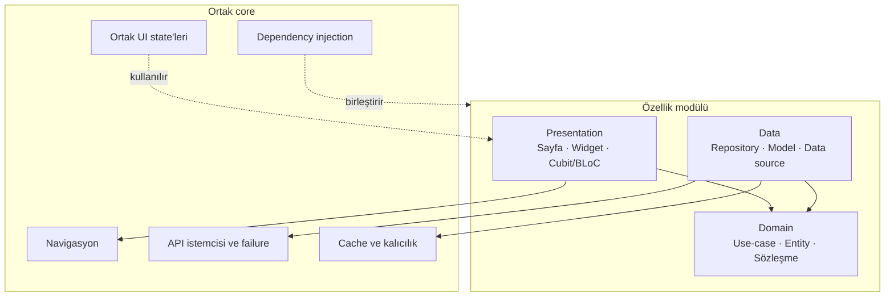

# Mimari

[English](ARCHITECTURE.md) · [Türkçe](ARCHITECTURE.tr.md)

Bu belge, özel Flutter projesinin salt-okunur incelenmesiyle doğrulanan desenleri özetler. Kaynak kod, domain kuralları, endpoint ayrıntıları, veritabanı şemaları ve iç isimlendirmeler bilerek dışarıda bırakılmıştır.

## Yapısal model

Proje ürün özelliklerine göre düzenlenir. Kapsamlı her özellik üç sorumluluğu ayırır:

- **Presentation:** sayfalar, ortak widget'lar, Cubit/BLoC sahipleri ve UI state modelleri
- **Domain:** entity'ler, repository sözleşmeleri ve use-case'ler
- **Data:** transport/kalıcılık modelleri, uzak ve yerel data source'lar, repository implementasyonları

Ortak servisler her özellikte tekrar kurulmak yerine core alanında yaşar.

Bağımlılık yönü domain katmanını korur: presentation use-case'leri çağırır; data implementasyonları domain'in sahip olduğu repository sözleşmelerini karşılar.

## State sahipliği

Cubit/BLoC örnekleri asenkron akışları sahiplenir ve açık immutable state'ler sunar. Ortak selector'lar state'in dar bir izdüşümünü izleyerek gereksiz rebuild kapsamını azaltır. Ortak paging sahibi ilk yükleme ile sonraki sayfayı ayrı modeller; cursor ve veri sonunu takip eder.

Birbirinin yerine geçen işlemler, eski yanıtın yeni kullanıcı niyetinin üzerine yazmaması için iptal edilebilir latest-wins davranışı kullanır.

## Ağ ve repository'ler

Ortak Dio istemcisi transport temelini sağlar. Özellik data source'ları uzak çağrıları yapar ve yanıtları data katmanı modellerine dönüştürür. Repository implementasyonları sonuçları domain sınırına taşır.

Uzak sistem exception'ları tipli uygulama failure'larına normalize edilir. Presentation katmanı HTTP ayrıntılarını bilmeden başarı/hata sonucunu tüketir.

## Dependency injection

GetIt modüller üzerinden başlatılır. Cache ve core servisleri özellik modüllerinden önce kurulur; uygulama asenkron kayıtların hazır olmasını bekler. Böylece oluşturma sırası açık, rota ve özellik üretimi soyutlamalara bağımlı kalır.

## Navigasyon

GoRouter deklaratif navigasyon sağlar. Rota modülleri ve fabrikaları, tüm bağımlılık ve sayfa kurulumunu tek dosyada toplamak yerine sahipliği özelliklere böler.

## Yerel veri ve cache

Depolama sorumluluğa göre seçilir:

- Yapısal, sorgulanabilir uygulama verisi ve migration'lar için Drift
- Hassas yerel değerler için secure storage
- Küçük tercih değerleri için shared preferences
- Medya/içerik için bellek ve disk cache servisleri

Özel veritabanı şeması ve saklama kuralları bilerek açıklanmaz.

## Görseller ve içerik

Ortak görsel soyutlaması ağ, asset ve encoded kaynaklarla birlikte placeholder, fallback, retry/timeout ve isteğe bağlı cache davranışını yönetir. Cached Network Image, Extended Image ve Flutter Cache Manager daha geniş medya stratejisinin parçasıdır.

## Arka plan ve olay güdümlü işler

Projede arka plan indirme yönetimi ve açık ilerleme state'leri bulunur. OneSignal entegrasyonu bildirim başlatma ile foreground/click/permission/subscription listener'larını sahiplenir. WebSocket ve Socket.IO istemcileri uygun yerlerde gerçek zamanlı etkileşimleri destekler.

## Responsive UI

Responsive araçlar genişlik, yükseklik, metin ve radius ölçekleme sunar. Breakpoint tabanlı navigasyon farklı ekran genişliklerini destekler. Ortak bileşenler tutarlı loading, skeleton, empty, failure ve retry sunumu sağlar.

## Sınır özeti

| Sınır | Sorumluluk |
| --- | --- |
| Widget/sayfa | State'i göstermek ve kullanıcı niyetini toplamak |
| Cubit/BLoC | Etkileşim state'ini ve asenkron akışları koordine etmek |
| Use-case | Domain'e dönük tek bir işlemi ifade etmek |
| Repository sözleşmesi | Domain'in ihtiyaç duyduğu yeteneği tanımlamak |
| Repository implementasyonu | Data source'ları koordine etmek ve dönüştürmek |
| Data source | Uzak veya yerel sistemle iletişim kurmak |
| Core servis | Özellikler arası altyapı sağlamak |
